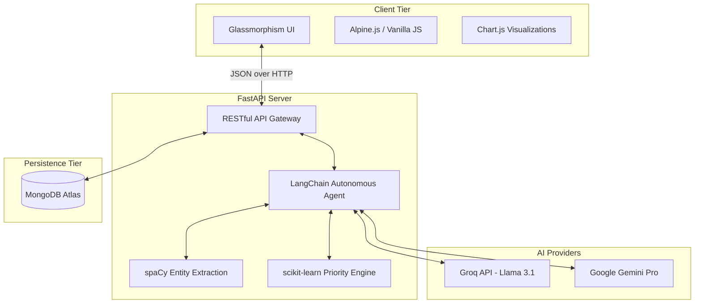

<div align="center">
  
  
  # LIFEOS
  **The Autonomous AI Life Operating System**
  
  *Don't manage your time. Let AI own it.*

  [](https://www.python.org/)
  [](https://fastapi.tiangolo.com)
  [](https://www.mongodb.com/)
  [](https://opensource.org/licenses/MIT)

  [**Live Demo**](#) • [**Watch Video**](#) • [**API Docs**](#)

</div>

---

## 🎯 What Does LIFEOS Do?

**LIFEOS** is an intelligent, autonomous decision engine disguised as a productivity tool. It is built for people with chaotic minds who are overwhelmed by traditional to-do lists. 

Instead of manually organizing your life, you simply **"brain dump"** your unstructured thoughts, and LIFEOS handles the rest.

### ⚙️ Core App Functionality & Workflows

1. 🧠 **The Brain Dump (Input Chaos)**
   - Type or speak your messy, unstructured thoughts into the app (e.g., *"I need to pay rent by Friday, finish my physics essay tomorrow, and oh, schedule a dentist appointment."*).
   - Our **NLP Engine (spaCy)** instantly parses the text, extracts actionable entities, isolates deadlines, and categorizes them (Work, Academic, Personal, Health).

2. ⚡ **Autonomous AI Processing**
   - The **LangChain Agent** takes over. Armed with 10 specialized tools, it thinks, decides, and acts on your behalf.
   - It breaks down massive, overwhelming projects into bite-sized, 15-minute actionable steps so you know exactly where to start.

3. 📊 **Machine Learning Priority Engine**
   - Not all deadlines are created equal. A custom **scikit-learn ML model** scores every single task across 8 critical dimensions (urgency, stress level, time required, etc.) to determine its *true* priority.
   - It automatically builds an optimal schedule based on your current mood and energy levels.

4. 🗓️ **Interactive Smart Calendar & Dashboard**
   - The AI automatically plots your tasks onto a beautiful, visual **FullCalendar** interface.
   - Simply drag and drop tasks to reschedule them. The UI provides a high-level overview of your streak, productivity score, and daily focus.

5. 🚨 **Emergency "Crisis Mode"**
   - Completely overwhelmed? Hit the **Crisis Button**. The entire app interface shifts to a focused, distraction-free red theme.
   - The AI generates an immediate, step-by-step survival battle plan to get you through last-minute emergencies and even drafts deadline extension emails for you.

6. 📈 **Procrastination Tracking & Weekly Reviews**
   - LIFEOS silently monitors your habits. It detects which tasks you chronically postpone and predicts avoidance patterns.
   - Every Sunday, it generates an **Automated Weekly Review** with data-driven insights and AI recommendations to improve your productivity for the next week.

---

## 🏗️ System Architecture

LIFEOS employs a modern, decoupled architecture designed for high availability and rapid AI inference.



## 🛠️ Technology Stack

| Category | Technologies Used |
|----------|-------------------|
| **Frontend** | HTML5, CSS3 (Custom Glassmorphism), Tailwind CSS (Utilities), Alpine.js, Chart.js, FullCalendar |
| **Backend** | Python 3.11+, FastAPI, Uvicorn, Pydantic |
| **AI & ML** | LangChain, Groq (Llama 3.1 70B), Google Gemini Pro, spaCy, scikit-learn |
| **Database** | MongoDB Atlas (Motor Async Driver) |
| **Deployment** | Docker, Google Cloud Run / Render (Backend), Vercel (Frontend) |

### 💡 Why This Stack Matters (User Benefits)
- **Zero-Lag AI (Groq + LangChain):** By leveraging Groq's ultra-fast inference for Llama 3.1, the autonomous agent processes complex life plans in milliseconds. It feels instantaneous, not like waiting for a chatbot.
- **Seamless ML Integration (FastAPI + Python):** Python allows us to run custom machine learning (scikit-learn) and NLP (spaCy) in the same highly-performant, asynchronous backend, giving you enterprise-grade analytics on your personal habits.
- **Calming, Low-Friction UI (Tailwind + Alpine.js):** The interface is deliberately designed with Glassmorphism and dark mode to reduce cognitive overload and anxiety when you are stressed.
- **Reliable Data Sync (MongoDB Atlas):** Your tasks, procrastination history, and AI insights are securely stored in a scalable cloud database, ensuring you never lose a critical deadline.

---

## 🚀 Getting Started

Follow these instructions to deploy a local instance of LIFEOS.

### Prerequisites
- Python 3.11 or higher
- MongoDB Atlas cluster (or local MongoDB instance)
- API Keys for Groq and Google Gemini

### 1. Clone the Repository
```bash
git clone https://github.com/vignesh-DA/Lifeos.git
cd Lifeos
```

### 2. Environment Setup
Create a virtual environment and install dependencies:
```bash
python -m venv venv
source venv/bin/activate  # On Windows use: venv\Scripts\activate
pip install -r requirements.txt
```

Download the required NLP models:
```bash
python -m spacy download en_core_web_sm
```

### 3. Configuration
Copy the sample environment file and add your credentials:
```bash
cp .env.example .env
```
Update `.env` with your secure keys:
```env
# Required API Keys
GEMINI_API_KEY=your_gemini_api_key
GROQ_API_KEY=your_groq_api_key

# Database
MONGODB_URI=your_mongodb_connection_string
DATABASE_NAME=lifeos

# Auth
SECRET_KEY=your_secure_random_string
GOOGLE_CLIENT_ID=your_oauth_client_id
GOOGLE_CLIENT_SECRET=your_oauth_client_secret
GOOGLE_REDIRECT_URI=http://localhost:8000/auth/callback
```

### 4. Run the Application
Launch the high-performance FastAPI server:
```bash
cd backend
uvicorn main:app --reload --port 8000
```
Navigate to `http://localhost:8000` in your browser. The backend seamlessly serves the static frontend.

---

## 🌐 Deployment

LIFEOS is containerized and ready for production deployment.

**Google Cloud Run (Recommended)**
```bash
gcloud builds submit --config cloudbuild.yaml
```

**Alternative: Render + Vercel**
- Backend: Deploy directly via Render connecting to your GitHub repo using `requirements.txt`.
- Frontend: Deploy via Vercel, utilizing the included `vercel.json` for API proxying.

---

## 🛡️ License

Distributed under the MIT License. See `LICENSE` for more information.

## 🤝 Contributing

Contributions are what make the open source community such an amazing place to learn, inspire, and create. Any contributions you make are **greatly appreciated**.

1. Fork the Project
2. Create your Feature Branch (`git checkout -b feature/AmazingFeature`)
3. Commit your Changes (`git commit -m 'Add some AmazingFeature'`)
4. Push to the Branch (`git push origin feature/AmazingFeature`)
5. Open a Pull Request

---
<div align="center">
  <b>Built with ❤️ for the VIBE2SHIP Hackathon 2026.</b><br>
  <i>Because your time is too valuable to manage manually.</i>
</div>
