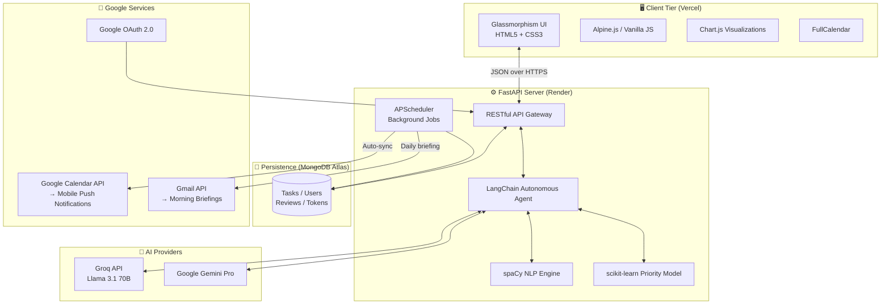

<div align="center">
  

  # LIFEOS
  ### The Autonomous AI Life Operating System

  *Don't manage your time. Let AI own it.*

  <br/>

  [](https://www.python.org/)
  [](https://fastapi.tiangolo.com)
  [](https://www.mongodb.com/)
  [](https://lifeos-ebon-kappa.vercel.app)
  [](https://opensource.org/licenses/MIT)
  [](https://lifeos-ebon-kappa.vercel.app)

  <br/>

  [**🌐 Live App**](https://lifeos-ebon-kappa.vercel.app) &nbsp;•&nbsp; [**🎬 Watch Demo**](https://drive.google.com/file/d/1_tRE6_nGyi7nFPi_feL6FDSFF9dzdH0q/view?usp=sharing) &nbsp;•&nbsp; [**⭐ Star this repo**](https://github.com/vignesh-DA/Lifeos)

  <br/>

  > 🏆 Built for the **VIBE2SHIP Hackathon 2026** — *Because your time is too valuable to manage manually.*

</div>

---

## 🧠 What is LIFEOS?

**LIFEOS** is not another to-do app. It is an **intelligent, autonomous decision engine** built for people with chaotic minds who are overwhelmed by traditional productivity tools.

You don't organize tasks. You **brain dump** — and LIFEOS thinks, prioritizes, schedules, and notifies you automatically.

```
You type:  "need to pay rent friday, finish physics essay tmrw, dentist appt sometime"
LIFEOS:    ✅ 3 tasks extracted → categorized → scored → scheduled → pushed to your Google Calendar
```

---

## ✨ Core Features

### 🧠 1. Brain Dump Engine
- Type or speak messy, unstructured thoughts — no formatting required
- **spaCy NLP** instantly extracts actionable tasks, deadlines, and categories
- Supports voice input for completely hands-free capture

### ⚡ 2. Autonomous AI Agent
- A **LangChain Agent** armed with 10 specialized tools thinks and acts on your behalf
- Breaks overwhelming projects into **15-minute actionable steps**
- Powered by **Groq (Llama 3.1 70B)** for near-instant inference — zero waiting

### 📊 3. ML Priority Engine
- A custom **scikit-learn model** scores every task across **8 dimensions**: urgency, stress level, estimated time, category weight, deadline proximity, postpone history, mood, and energy
- Builds an optimal daily schedule that adapts to how you actually feel

### 🗓️ 4. Smart Calendar & Google Notifications
- Tasks auto-sync to your **Google Calendar** with priority-based reminders
- **Mobile push notifications** fire automatically via the Google Calendar app
  - 🔴 URGENT: 2-hour + 30-min popup + 15-min email
  - 🟡 MEDIUM: 1-hour + 15-min popup
  - 🟢 LOW: 30-min popup
- Drag-and-drop rescheduling on the FullCalendar interface

### 🚨 5. Crisis Mode
- Completely overwhelmed? Hit **Crisis Mode** — the UI shifts to a focused red theme
- AI generates an immediate step-by-step **survival battle plan**
- Auto-drafts **deadline extension emails** for you — one click to send

### 📈 6. Procrastination Intelligence
- LIFEOS silently tracks which tasks you chronically delay
- Predicts your avoidance patterns before they happen
- Every Sunday: **Automated Weekly Review** with data-driven insights and next-week recommendations

### 🌅 7. Morning Briefings
- Every day at 8:00 AM, a personalised briefing is drafted to your Gmail
- Shows today's focus tasks ranked by true priority + your current streak

---

## 🏗️ System Architecture



---

## 🛠️ Technology Stack

| Layer | Technology | Purpose |
|-------|-----------|---------|
| **Frontend** | HTML5, CSS3 (Glassmorphism), Alpine.js | Reactive, low-friction UI |
| **Styling** | Tailwind CSS utilities, Chart.js | Data visualizations |
| **Calendar** | FullCalendar | Drag-and-drop task scheduling |
| **Backend** | Python 3.11+, FastAPI, Uvicorn | Async API server |
| **Validation** | Pydantic v2 | Request/response modeling |
| **AI Agent** | LangChain + Groq (Llama 3.1 70B) | Autonomous task reasoning |
| **LLM Fallback** | Google Gemini Pro | Crisis mode + weekly reviews |
| **NLP** | spaCy `en_core_web_sm` | Entity extraction from brain dumps |
| **ML** | scikit-learn | Priority scoring across 8 dimensions |
| **Database** | MongoDB Atlas + Motor (async) | Cloud-persistent task storage |
| **Auth** | Google OAuth 2.0 | Secure login + Google API access |
| **Notifications** | Google Calendar API | Mobile push via popup reminders |
| **Email** | Gmail API | Morning briefings as Gmail drafts |
| **Scheduler** | APScheduler (AsyncIO) | Every-5-min sync, daily/weekly jobs |
| **Deployment** | Vercel (frontend) + Render (backend) | Production hosting |
| **Container** | Docker | Portable, reproducible builds |

### 💡 Why This Stack?

- **Zero-Lag AI (Groq + LangChain):** Groq's hardware-accelerated inference processes complex life plans in milliseconds — feels instant, not like a chatbot
- **Real Push Notifications (Google Calendar API):** Events are created server-side with explicit `popup` reminders — your phone buzzes at the right time without any extra app
- **Scalable Async (FastAPI + Motor):** Every DB query and AI call is non-blocking — the server handles hundreds of concurrent users without threading overhead
- **Reliable Idempotency (MongoDB atomic ops):** The calendar sync uses `find_one_and_update` with a `"pending"` sentinel — concurrent scheduler runs can't create duplicate Google Calendar events
- **Calming UI (Glassmorphism + Alpine.js):** Dark mode + blur effects deliberately reduce cognitive overload when you're already stressed

---

## 🚀 Getting Started

### Prerequisites

| Requirement | Version |
|------------|---------|
| Python | 3.11+ |
| MongoDB | Atlas cluster (free tier works) |
| Groq API key | [console.groq.com](https://console.groq.com) |
| Google Gemini API key | [aistudio.google.com](https://aistudio.google.com) |
| Google OAuth credentials | [console.cloud.google.com](https://console.cloud.google.com) |

> **Required Google OAuth Scopes:** `calendar.events` + `gmail.compose` — users grant these on first login so mobile push notifications work out of the box.

---

### 1. Clone the Repository

```bash
git clone https://github.com/vignesh-DA/Lifeos.git
cd Lifeos
```

### 2. Environment Setup

```bash
python -m venv venv
source venv/bin/activate        # Windows: venv\Scripts\activate
pip install -r requirements.txt
```

Download the NLP model:

```bash
python -m spacy download en_core_web_sm
```

### 3. Configuration

```bash
cp .env.example .env
```

Edit `.env` with your credentials:

```env
# ── AI Keys ────────────────────────────────────────────────────
GEMINI_API_KEY=your_gemini_api_key
GROQ_API_KEY=your_groq_api_key

# ── Database ────────────────────────────────────────────────────
MONGODB_URI=your_mongodb_connection_string
DATABASE_NAME=lifeos

# ── Auth & Google APIs ──────────────────────────────────────────
SECRET_KEY=your_secure_random_string_min_32_chars
GOOGLE_CLIENT_ID=your_oauth_client_id
GOOGLE_CLIENT_SECRET=your_oauth_client_secret
GOOGLE_REDIRECT_URI=http://localhost:8000/auth/callback
```

### 4. Run Locally

```bash
cd backend
uvicorn main:app --reload --port 8000
```

Open [`http://localhost:8000`](http://localhost:8000) — the backend serves the frontend statically.

---

## 📱 Mobile Push Notifications — How It Works

LIFEOS creates real **Google Calendar events** with explicit reminder overrides whenever a task is saved. No extra app needed — just the Google Calendar app on your phone.

```
Task created in LIFEOS
        ↓
Backend calls Google Calendar API
        ↓
Event created with useDefault: False + explicit popup reminders
        ↓
Google pushes to every device signed into that Google account:
    📱 Android  →  Google Calendar push notification
    🍎 iPhone   →  Google Calendar push notification
    🖥️ Desktop  →  Google Calendar popup + email
```

**Requirements on user's side:**
1. Log in with Google (grants `calendar.events` scope on first login)
2. Google Calendar app installed (pre-installed on Android)
3. Notifications enabled for Google Calendar

---

## 🌐 Deployment

LIFEOS is live at **[lifeos-ebon-kappa.vercel.app](https://lifeos-ebon-kappa.vercel.app)** using a split deployment:

### Frontend → Vercel

The `frontend/` directory is deployed directly to Vercel. API calls are proxied via `vercel.json`.

```bash
# From project root
vercel --prod
```

### Backend → Render

```bash
# Render auto-deploys from GitHub on push to main
# Build command: pip install -r requirements.txt
# Start command: cd backend && uvicorn main:app --host 0.0.0.0 --port $PORT
```

### Self-hosted → Docker

```bash
docker build -t lifeos .
docker run -p 8000:8000 --env-file .env lifeos
```

### Google Cloud Run

```bash
gcloud builds submit --config cloudbuild.yaml
```

---

## 📁 Project Structure

```
Lifeos/
├── backend/
│   ├── main.py               # FastAPI app entrypoint
│   ├── config.py             # Settings & env vars
│   ├── routes/
│   │   ├── tasks.py          # Task CRUD + calendar auto-sync
│   │   ├── agent.py          # LangChain brain dump endpoint
│   │   ├── auth.py           # Google OAuth + session management
│   │   ├── crisis.py         # Crisis mode AI planning
│   │   └── insights.py       # Weekly reviews & analytics
│   ├── services/
│   │   └── scheduler.py      # APScheduler background jobs
│   ├── utils/
│   │   └── google_api.py     # Calendar & Gmail API helpers
│   ├── ml/
│   │   └── priority.py       # scikit-learn priority model
│   ├── nlp/
│   │   └── extractor.py      # spaCy NLP pipeline
│   └── db/
│       └── mongodb.py        # Motor async MongoDB client
├── frontend/
│   ├── index.html            # Landing / brain dump
│   ├── dashboard.html        # Main productivity dashboard
│   ├── calendar.html         # FullCalendar view
│   ├── crisis.html           # Crisis mode interface
│   ├── insights.html         # Analytics & weekly reviews
│   ├── js/
│   │   ├── app.js            # Core app logic
│   │   ├── calendar.js       # FullCalendar integration
│   │   └── charts.js         # Chart.js visualizations
│   └── css/                  # Custom glassmorphism styles
├── Dockerfile
├── requirements.txt
└── .env.example
```

---

## 🛡️ License

Distributed under the MIT License. See [`LICENSE`](LICENSE) for more information.

---

## 🤝 Contributing

Contributions are what make the open source community such an amazing place to learn, inspire, and create. Any contributions are **greatly appreciated**.

1. Fork the Project
2. Create your Feature Branch (`git checkout -b feature/AmazingFeature`)
3. Commit your Changes (`git commit -m 'Add some AmazingFeature'`)
4. Push to the Branch (`git push origin feature/AmazingFeature`)
5. Open a Pull Request

---

## 🙌 Acknowledgements

- [Groq](https://groq.com) — ultra-fast LLM inference
- [LangChain](https://langchain.com) — autonomous agent framework
- [FullCalendar](https://fullcalendar.io) — interactive calendar UI
- [MongoDB Atlas](https://www.mongodb.com/atlas) — cloud database
- [FastAPI](https://fastapi.tiangolo.com) — modern async Python API framework

---

<div align="center">
  <b>Built with ❤️ for the VIBE2SHIP Hackathon 2026.</b><br/>
  <i>Because your time is too valuable to manage manually.</i>
  <br/><br/>
  <a href="https://lifeos-ebon-kappa.vercel.app">
    
  </a>
</div>
